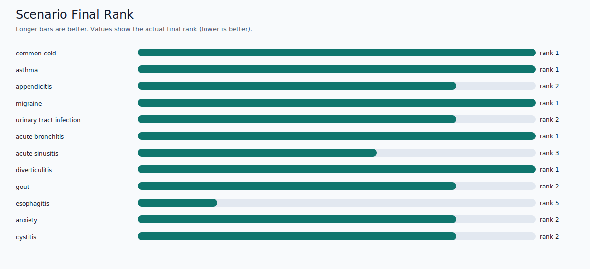
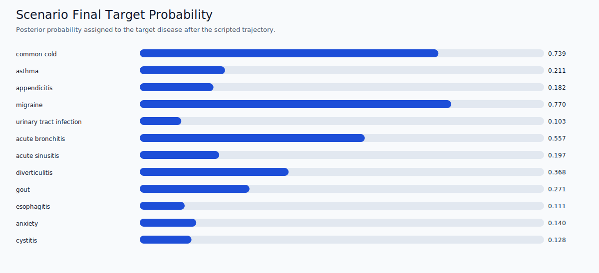
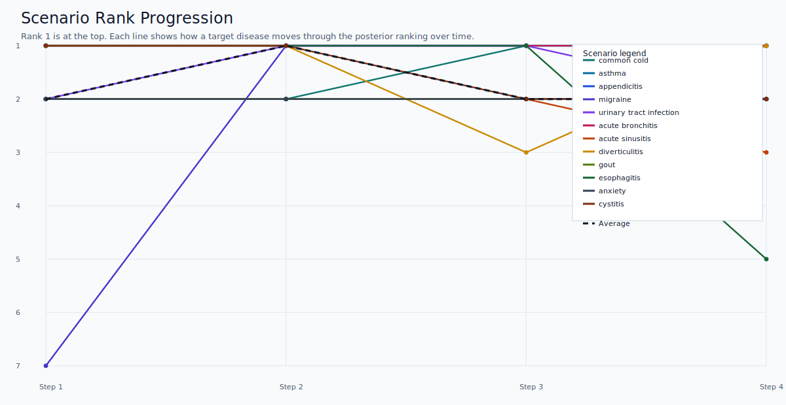

# Deduction Backend Test Report

Generated: `2026-03-13T14:51:12.765783+00:00`

## Automated Test Summary

- Total tests: `14`
- Failures: `0`
- Errors: `0`
- Skipped: `0`
- Successful: `True`

## Scenario Benchmark Summary

- Scenarios: `12`
- Passed threshold: `12`
- Failed threshold: `0`
- Average final rank: `1.917`
- Median final rank: `2.0`
- Average final score: `0.3147`
- Average rank gain from prior: `66.583`

## Graphs

## Scenario Table

| Scenario | Target disease | Seed symptom | Prior rank | Final rank | Expected max rank | Final score | Top disease | Status |
| --- | --- | --- | ---: | ---: | ---: | ---: | --- | --- |
| Common cold trajectory | common cold | flu-like syndrome | 84 | 1 | 3 | 0.739 | common cold | PASS |
| Asthma trajectory | asthma | coughing up sputum | 86 | 1 | 3 | 0.211 | asthma | PASS |
| Appendicitis trajectory | appendicitis | stomach bloating | 91 | 2 | 2 | 0.182 | cholecystitis | PASS |
| Migraine trajectory | migraine | symptoms of the face | 346 | 1 | 5 | 0.770 | migraine | PASS |
| UTI trajectory | urinary tract infection | suprapubic pain | 48 | 2 | 2 | 0.103 | balanitis | PASS |
| Acute bronchitis trajectory | acute bronchitis | congestion in chest | 13 | 1 | 2 | 0.557 | acute bronchitis | PASS |
| Acute sinusitis trajectory | acute sinusitis | sinus congestion | 81 | 3 | 5 | 0.197 | chronic sinusitis | PASS |
| Diverticulitis trajectory | diverticulitis | constipation | 12 | 1 | 2 | 0.368 | diverticulitis | PASS |
| Gout trajectory | gout | ankle swelling | 19 | 2 | 2 | 0.271 | injury to the leg | PASS |
| Esophagitis trajectory | esophagitis | upper abdominal pain | 7 | 5 | 5 | 0.111 | acute pancreatitis | PASS |
| Anxiety trajectory | anxiety | fears and phobias | 34 | 2 | 2 | 0.140 | marijuana abuse | PASS |
| Cystitis trajectory | cystitis | symptoms of bladder | 1 | 2 | 2 | 0.128 | benign prostatic hyperplasia (bph) | PASS |

Detailed per-step traces are available in `scenario_results.json`.